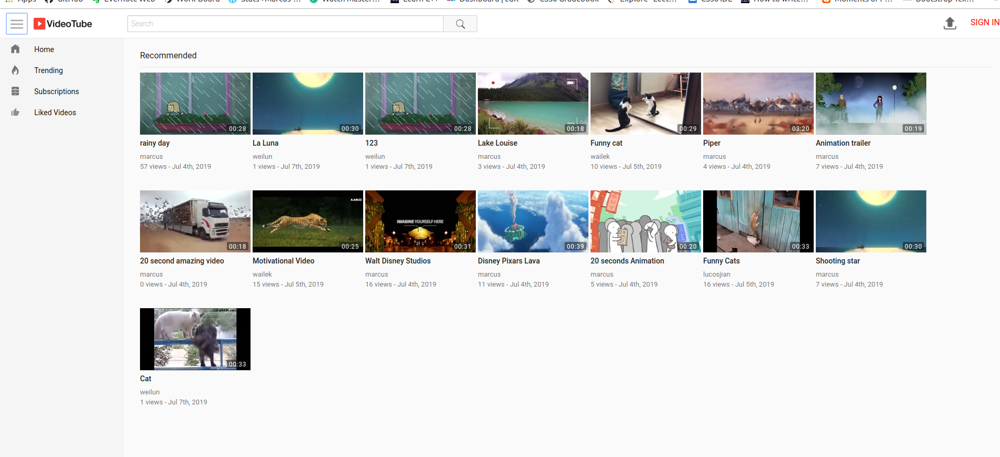

# YouTube-Clone
This is a project aiming to create a YouTube-Clone using PHP, JavaScript and MySQL. The final product will contain the basic functionalities of YouTube such as 
1. Creating an account
2. Uploading videos 
3. Viewing videos
4. Searching videos
5. Subscribing to other users
6. Liking and commenting videos

This final product is deployed on heroku which can be access through this [link](https://marcus-tube.herokuapp.com).

A sample look of the homepage is as shown below:

## What I have learned
1. Created my first web application using PHP
2. MySQL database system
3. Process videos using FFmpeg
4. JQuery & Ajax
5. Deploying application on Heroku
6. CSS flex property
